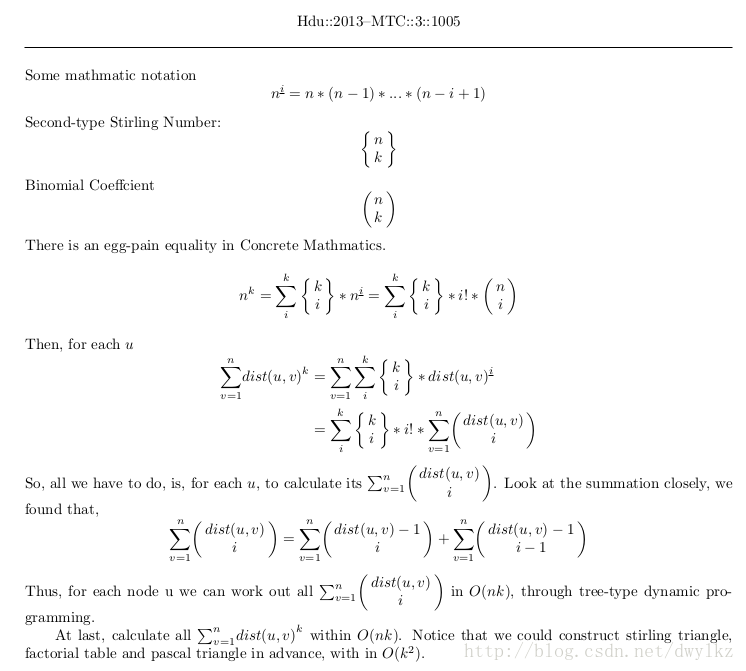

# HDU 4625 - JZPTREE
_July 21 2018 1204_

[Problem Statement](http://acm.hdu.edu.cn/showproblem.php?pid=4625).

### Solution


### Code
```cpp
// rebornplusplus
// Jul 16 2018 0953

#include <bits/stdc++.h>
using namespace std;

typedef long long ll;
typedef long double ld;
typedef pair<int, int> pii;
typedef pair<long long, long long> pll;
#define ff first
#define ss second
#define mp make_pair
#define pb push_back
#define ub upper_bound
#define lb lower_bound
#define all(x) (x).begin(), (x).end()
#define dbg(x) cout << " -- dbg: " << (x) << "\n"
#define FastIO ios_base::sync_with_stdio(false); cin.tie(0); cout.tie(0);
const long long INF = 2000000000LL;

const int N = 50000 + 7;
const int K = 500 + 7;
const int MOD = 10007;
int fact[K];	// factorial
int st[K][K];	// stirling number of second kind
int dp[N][K];	// dist[u][k] is the result for node u
int rest[K];	// temporary
vector<int> g[N];
int n, k;

void preCal() {
	fact[0] = 1, st[0][0] = 1;
	for(int i=1; i<K; ++i) {
		fact[i] = (i * fact[i-1]) % MOD;
		st[i][0] = st[0][i] = 0;
	}
	for(int i=1; i<K; ++i) {
		for(int j=1; j<=i; ++j) {
			st[i][j] = (st[i-1][j-1] + j * st[i-1][j]) % MOD;
		}
	}
}

void dfs1(int u, int p) {
	for(int v : g[u]) {
		if(v == p) continue;
		dfs1(v, u);
		for(int i=0; i<=k; ++i) {
			dp[u][i] = (dp[u][i] + dp[v][i] + (i>0 ? dp[v][i-1] : 0) + (i<=1)) % MOD;
		}
	}
}

void dfs2(int u, int p) {
	if(p > 0) {
		for(int i=0; i<=k; ++i) rest[i] = dp[p][i];
		for(int i=0; i<=k; ++i) {
			rest[i] = (rest[i] - (dp[u][i] + (i>0 ? dp[u][i-1] : 0) + (i<=1)) % MOD + MOD) % MOD;
		}
		for(int i=0; i<=k; ++i) {
			dp[u][i] = (dp[u][i] + rest[i] + (i>0 ? rest[i-1] : 0) + (i<=1)) % MOD;
		}
	}
	for(int v : g[u]) if(v != p) dfs2(v, u);
}

int main() {
	FastIO;

	preCal();
	int t;
	cin >> t;
	while(t--) {
		cin >> n >> k;
		for(int i=1; i<=n; ++i) g[i].clear();
		for(int i=1; i<n; ++i) {
			int u, v;
			cin >> u >> v;
			g[u].pb(v);
			g[v].pb(u);
		}

		memset(dp, 0, sizeof dp);
		dfs1(1, 0);
		dfs2(1, 0);
		for(int u=1; u<=n; ++u) {
			int res = 0;
			for(int i=0; i<=k; ++i) {
				res = (res + ((st[k][i] * fact[i]) % MOD) * dp[u][i]) % MOD;
			}
			cout << res << "\n";
		}
	}

	return 0;
}
```

Thanks to [this blog](https://blog.csdn.net/dwylkz/article/details/9749827) for the amazing explanation. I had my minds blown when I saw the formul for n^k. _-

By the way, fun fact, I ran both the dfs making 5 as root mistakenly. :p And they passed! They didn't make any small case. :v

***


