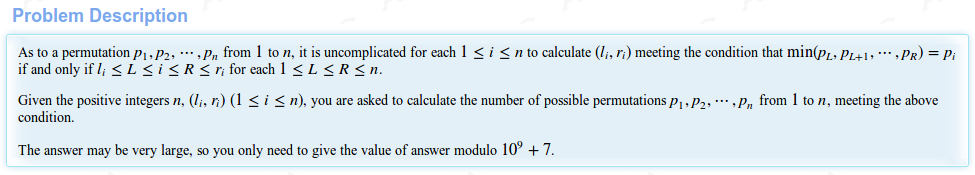

# HDU 6044 - Limited Permutation
_July 21 2018 0820_

I don't think I could make you understand the problem more than the [statement itself](http://acm.hdu.edu.cn/showproblem.php?pid=6044).


### Solution
Think about the minimum element in that array. The minimum is 1? Now what will be the corresponding `l` and `r` for that? Shouldn't it be 1 and 5? So, for one thing you know where the minimum element is. Now suppose the array size is 10. And the minimum element is at 4. So you get two partitions? `1-3` and `5-10`? And now you can choose for which elements goes where. As 1 is fixed at index 4, there are 9 remaining numbers. So, `9C3` ways to choose numbers for interval `1-3` and `6C6` for `5-10`. Now we do the same thing for those intervals. Track the minimum position and multiply the number of ways with the result to put numbers in both intervals around that minimum value position. <br/>
That being said, it can be solved in O(nlg n). Sort the given ranges in ascending order of `l` and descending order of `r`. For a range, that minimum number should be at the very beginning. Think about that for a moment.

Also, there are possibilites that the given permutation is not valid. Check for that too.

### Code
```cpp
#include <bits/stdc++.h>
using namespace std;

typedef long long ll;
typedef long double ld;
typedef pair<int, int> pii;
typedef pair<long long, long long> pll;
#define ff first
#define ss second
#define mp make_pair
#define pb push_back
#define ub upper_bound
#define lb lower_bound
#define all(x) (x).begin(), (x).end()
#define dbg(x) cout << " -- dbg: " << (x) << "\n"
#define FastIO ios_base::sync_with_stdio(false); cin.tie(0); cout.tie(0);
const long long INF = 2000000000LL;

const ll MOD = 1000000000 + 7;
const int N = 1000000 + 7;
ll fact[N], inv[N];
struct dat {
	int l, r, id;
	bool operator < (const dat &p) {
		if(l == p.l) return r > p.r;
		return l < p.l;
	}
} a[N];

namespace fastIO
{
    #define BUF_SIZE 100000
    //fread -> read
    bool IOerror=0;
    inline char nc()
    {
        static char buf[BUF_SIZE],*p1=buf+BUF_SIZE,*pend=buf+BUF_SIZE;
        if(p1==pend)
        {
            p1=buf;
            pend=buf+fread(buf,1,BUF_SIZE,stdin);
            if(pend==p1)
            {
                IOerror=1;
                return -1;
            }
        }
        return *p1++;
    }
    inline bool blank(char ch)
    {
        return ch==' '||ch=='\n'||ch=='\r'||ch=='\t';
    }
    inline void read(int &x)
    {
        char ch;
        while(blank(ch=nc()));
        if(IOerror)return;
        for(x=ch-'0';(ch=nc())>='0'&&ch<='9';x=x*10+ch-'0');
    }
    #undef BUF_SIZE
}
using namespace fastIO;

inline ll bigmod(ll a, ll p, const ll &mod) {
	if(p == 0) return 1 % mod;
	if(p % 2) return (a * bigmod(a, p-1, mod)) % mod;
	ll ret = bigmod(a, p/2, mod);
	return (ret * ret) % mod;
}

// mod has to be prime
inline ll modinv(ll a, const ll &mod) {
	return bigmod(a, mod-2, mod);
}

// nCr ( mod mod )
inline ll ncr(ll n, ll r, const ll &mod) {
	// ll ret = (fact[n] * modinv(fact[r], mod)) % mod;
	// ret = (ret * modinv(fact[n-r], mod)) % mod;
	if(r > n or r < 0) return 0;
	ll ret = (fact[n] * inv[r]) % mod;
	ret = (ret * inv[n-r]) % mod;
	// cout << "( " << n << " " << r << " ) returned " << ret << "\n";
	return ret;
}

void preCal() {
	fact[0] = 1;
	for(ll i=1; i<N; ++i) fact[i] = (i * fact[i-1]) % MOD;
	inv[N-1] = modinv(fact[N-1], MOD);
	for(ll i=N-2; i>=0; --i) inv[i] = (inv[i+1] * (i+1)) % MOD;
}

int idx;
inline ll forfuckssake(int l, int r) {
	if(l > r) return 1;
	++idx;
	if(a[idx].l != l or a[idx].r != r) return 0;
	if(l == r) return 1;

	int pos = a[idx].id;
	if(pos > r or pos < l) return 0;
	ll ret = 1;
	ret = (forfuckssake(l, pos-1) * forfuckssake(pos+1, r)) % MOD;
	ret = (ret * ncr(r-l, r-pos, MOD)) % MOD;
	return ret;
}

int main() {
	preCal();

	int n, tc=0;
	while(read(n), !IOerror) {
		for(int i=1; i<=n; ++i) read(a[i].l);
		for(int i=1; i<=n; ++i) read(a[i].r);
		for(int i=1; i<=n; ++i) a[i].id = i;
		sort(a+1, a+n+1);

		idx = 0;
		ll res = forfuckssake(1, n);
		printf("Case #%d: %lld\n", ++tc, res);
	}

	return 0;
}
```
( Sorry about the function name. :3 I had to debug for 2 fukin hours and do you want to know what the bug was? A fucking `#` before the case number. I didn't type it when I submitted. ) 
