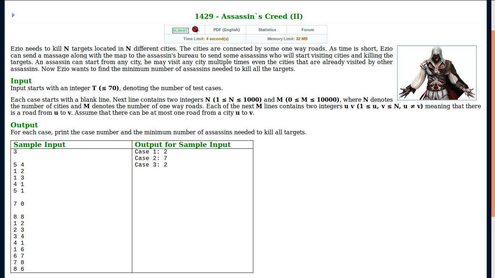

# LightOJ 1429 - Assasin's Creed (II)
_Jul 25 2018 0657_

<br/>
I liked the problem so much that I couldn't help but take an screenshot! :) [Problem Statement](http://lightoj.com/volume_showproblem.php?problem=1429)

### Solution

First listen to this :v 


Okay, now let's solve the problem. Notice that we can re-visit nodes. So, we convert the graph to a DAG by compressing the SCCs to single nodes. Why?  Well, SCCs can be visited multiple times and you can enter from one end and exit from another. It seems reasonable that we compress the SCCs and reduce our coding complexity.

Now, see if the following matches our problem: "Given a DAG. You have to find the minimum number of paths that cover all the vertices." Note that, it isn't necessary that a vertex will belong to only one path as vertices can be re-visited. This is actually a classic problemn, namely the *Minimum Path Cover* problem. You can browse for some solutions to this.

What I did is I found the transitive closure of the graph. Then ran a maximum bipartite matching with the transitive closure as a new graph. The result to this problem is number of vertices in that DAG minus the number of matching.

### Code
```cpp
// LightOJ 1429 - Assassin`s Creed (II)
// rebornplusplus
// July 25 2018 0652

#include <bits/stdc++.h>
using namespace std;

const int N = 1000 + 7;

/*////////////////////
adj[] is the main graph
trans[] strores tranpose graph
ind[u] will store the component number where u belongs to
////////////////////*/
const int maxn = N; 	// 1e5
vector<int> adj[maxn], trans[maxn]; 
int ind[maxn], idx = 0; 
bool vis[maxn];
stack<int> st; 

void dfs(int u) {
	vis[u] = true;
	for(int i=0; i<(int) adj[u].size(); ++i) {
		int v = adj[u][i];
		if(!vis[v]) dfs(v);
	}
	st.push(u);
}
void dfs2(int u) {
	ind[u] = idx;
	for(int i=0; i<(int) trans[u].size(); ++i) {
		int v = trans[u][i];
		if(!ind[v]) dfs2(v);
	}
}
int scc(int n) {
	memset(vis, false, sizeof vis);
	while(!st.empty()) st.pop();
	for(int i = 1; i <= n; i++) {
		if(!vis[i]) dfs(i);
	}
	for(int u = 1; u <= n; u++) {
		for(int i=0; i<(int) adj[u].size(); ++i) {
			int v = adj[u][i];
			trans[v].push_back(u);
		}
	}
	idx = 0;
	memset(ind, 0, sizeof ind);
	while(!st.empty()) {
		int u = st.top(); st.pop();
		if(ind[u]) continue; 
		idx++; dfs2(u); 
	}
	return idx;
}

int ns;	// number of scc
vector<int> sc[N];	// scc dag
bool tcr[N][N];		// transitive closure

void dfs3(int u) {
	vis[u] = true;
	for(int i=0; i<(int) sc[u].size(); ++i) {
		int v = sc[u][i];
		if(!vis[v]) dfs3(v);
		for(int j=1; j<=ns; ++j) {
			if(tcr[v][j]) tcr[u][j] = true;
		}
		tcr[u][v] = true;
	}
}

const int MAXN = N;	// 5007
// bool vis[MAXN];
int lpair[MAXN], rpair[MAXN];	// left pair of right node and right pair of left node
// vector<int> adj[MAXN];

bool bipartite_matching(int u) {
	for(int i=0; i<(int) adj[u].size(); ++i) {
		int v = adj[u][i];
		if(vis[v]) continue;
		
		vis[v] = true;
		if(lpair[v] == -1 or bipartite_matching(lpair[v])) {
			lpair[v] = u;
			rpair[u] = v;
			return true;
		}
	}
	return false;
}

// n is the number of nodes on the left side
int max_matching(int n) {
	memset(lpair, -1, sizeof lpair);
	memset(rpair, -1, sizeof rpair);
	int ret = 0;
	for(int i=1; i<=n; ++i) {
		memset(vis, false, sizeof vis);
		ret += bipartite_matching(i);
	}
	return ret;
}

int main() {
	int t, tc=0;
	scanf("%d", &t);
	
	while(t--) {
		int n, m;
		scanf("%d %d", &n, &m);
		for(int i=1; i<=n; ++i) adj[i].clear(), trans[i].clear();
		while(m--) {
			int u, v;
			scanf("%d %d", &u, &v);
			adj[u].push_back(v);
		}
		
		ns = scc(n);
		for(int i=1; i<=n; ++i) sc[i].clear();
		for(int u=1; u<=n; ++u) {
			for(int i=0; i<(int) adj[u].size(); ++i) {
				int v = adj[u][i];
				if(ind[u] == ind[v]) continue;
				sc[ind[u]].push_back(ind[v]);
			}
		}

		memset(vis, false, sizeof vis);
		memset(tcr, false, sizeof tcr);
		for(int i=1; i<=ns; ++i) if(!vis[i]) dfs3(i);
		
		for(int i=1; i<=n; ++i) adj[i].clear();
		for(int i=1; i<=ns; ++i) {
			for(int j=1; j<=ns; ++j) {
				if(tcr[i][j]) adj[i].push_back(j);
			}
		}
		int matches = max_matching(ns);

		int res = ns - matches;
		printf("Case %d: %d\n", ++tc, res);
	}

	return 0;
}
```

I'll be honest. This problem took me a night, really. I re-coded SCC. Solved some of the straight forward problems to see if my code works perfectly. Then updated my templates of that. Then again, I learnt about Kuhn's algorithm of Bipartite Matching. Coded that, solved some problems then updated the template. After all that havoc, I coded this one!
