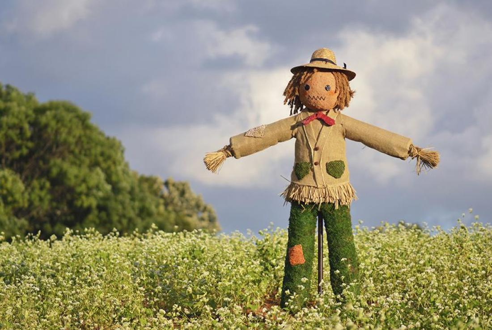
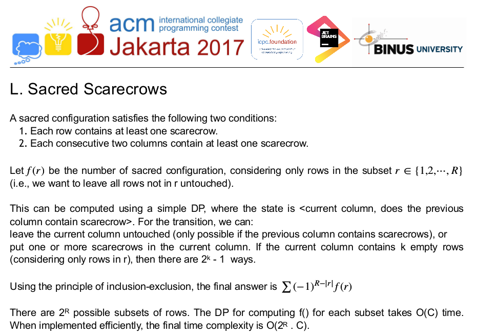

# UVaLive 8144 - Sacred Scarecrows
_Aug 09 2018 2251_


Image taken from [MENTAL FLOSS](http://mentalfloss.com/article/70232/do-scarecrows-actually-work)

You're given a grid of max 14x1000 size. There are some blocked cells. In each non-block cell you can put a scarecrow. There are two conditions though.
* Each row must have at least one scarecrow
* There should be at least one scarecrow in two consecutive columns

You have to count the number of ways you can put scarecrows on the given grid. [Problem Statement](https://icpcarchive.ecs.baylor.edu/index.php?option=com_onlinejudge&Itemid=8&page=show_problem&problem=6166)

### Solution

Um, you can access the editorials [here](https://github.com/jonathanirvings/icpc-jakarta-2017). This problem appeared in ACM ICPC Jakarta 2017. Look for `scarecrow`, problem L. I am giving a snap of those texts and elaborate on the inclusion-exclusion part.


Now, onto the inclusion-exclusion part, here's where I lost the track, for each row consider a property `P` which is true when the row is empty of scarecrows i.e. there's no scarecrow on that row. So the answer should be the number of elements in the set (P1' P2' ... Pr') where r is the number of rows. Consider only three rows and let's name the property of not having any scarecrow in the first row `A`, `B` for second and `C` for third.<br/>
```
So, N(A'B'C') = N - N(A U B U C)
              = N - [ N(A) + N(B) + N(C) - N(AB) - N(BC) - N(CA) + N(ABC) ]
              = N(NULL) - N(A) - N(B) - N(C) + N(AB) + N(BC) + N(CA) - N(ABC)
```
While implementing, for each property we reset that corresponding bit in the mask to 0.

Implementation:

```cpp
#include <bits/stdc++.h>
using namespace std;

typedef long long ll;

const ll MOD = 1000000000+7;
const int C = 1007;
ll dp[C][2];    // current column, take or not
int cmask[C];

int main() {
    FastIO;
    
    int r, c;
    while(cin >> r >> c) {
        memset(cmask, 0, sizeof cmask);
        for(int i=0; i<r; ++i) {
            string s;
            cin >> s;
            for(int j=1; j<=c; ++j) cmask[j] = (cmask[j] << 1) + (s[j-1] == '.');
        }
        
        ll res = 0;
        for(int mask=0; mask<(1<<r); ++mask) {
            dp[0][0] = 0;
            dp[0][1] = 1;
            for(int i=1; i<=c; ++i) {
                int submask = (mask & cmask[i]);
                int len = __builtin_popcount(submask);
                dp[i][0] = dp[i-1][1];
                dp[i][1] = (ll) ((1<<len)-1) * (dp[i-1][0] + dp[i-1][1]);
                dp[i][1] %= MOD;
            }
            int len = __builtin_popcount(mask);
            ll temp = dp[c][0] + dp[c][1];
            if((r-len) & 1) res = (res - temp + MOD) % MOD;
            else res = (res + temp) % MOD;
        }
        cout << res << "\n";
    }
    
    return 0;
}
```
There's this problem in lightoj, [Tiles (III)](http://lightoj.com/volume_showproblem.php?problem=1310). While I was approaching "Scarecrow", "Tiles" was remembered so many times. _-

***


